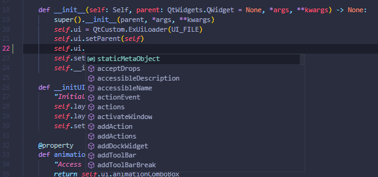
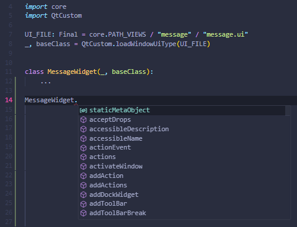

# QtCustom
The Qt Custom Module allows you to create user interfaces that extend the widget classes of the QtWidgets module's UI element set.

## QAnimationComboBox
QAnimationComboBox is a class that inherits from QComboBox and is a QComboBox with Animation as the name suggests.

## QExUiLoader
### Uiloader
Uiloader is a variable that calls QExUiLoader, which inherits from QUiLoader. This variable can use the Widget class that QtCustom has. It can be used in the same way as a normal QUiLoader, but this Uiloader is compatible with pathlib.WindowPath, so you can put a Path using pathlib as it is. Also, it can be used on the IDE by using the one.
```py
from pathlib import Path
from QtCustom import ExUiLoader

UI_FILE: Path = Path(r"C:\hoge")
ui = ExUiLoader(UI_FILE)
```
  


### loadWidgetUiType, loadWindowUiType
loadWidgetUiType and loadWindowUiType are based on the function loadUiType, which generates and loads a .ui file at runtime and returns a tuple containing a Python class reference and base class.
The difference with loadUiType is that, as the names Widget and Window indicate, the Python class reference and base class that loaded the .ui created by the QWidget base or the QMainWindow base, respectively, can be used with these functions The point is that annotations can be used on the IDE by using these functions.

```py
from pathlib import Path
from QtCustom import loadWidgetUiType

UI_FILE: Path = Path(r"C:\hoge\hogeWidget.ui")
_, baseClass= loadWidgetUiType(UI_FILE)


class HogeWidget(_, baseClass):
    ...
```
  


## QFloatSlider
QFloatSlider is a class that combines QDoubleSpinBox and QSlider.

## QFlowLayout
QFlowLayout is a layout class that inherits from QLayout and automatically rearranges the layout according to the geometry.

## QIntSlider
QIntSlider is a class that combines QSpinBox and QSlider.

## QAvstractProgressCircular
QProgressCircular is a ProgressBar in the shape of a circle.

## QProgressCircular
QProgressCircular is a ProgressBar in the shape of a circle.
It inherits from QAbstractProgressCircular.

## QCircularSlider
  
QCircularSlider is a slider in the shape of a circle.
It inherits from QAbstractProgressCircular.