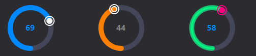

# QtCustom
Qtカスタムモジュールでは、QtWidgetsモジュールのUI要素セットのウィジェットクラスを拡張したユーザーインターフェースを作成することができます。

## QAnimationComboBox
QAnimationComboBoxは、QComboBoxを継承したクラスで名前の通りAnimationが付いたQComboBoxになります

## QExUiLoader
QExUiLoaderはQUiLoaderを継承したQtCustomのクラスを.uiから利用する際に使用できます

## QFloatSlider
QFloatSliderはQDoubleSpinBoxとQSliderを組み合わせたクラスです

## QFlowLayout
QFlowLayoutは、QLayoutを継承したレイアウトクラスで、ジオメトリに応じて自動的にレイアウトが変更されます。

## QIntSlider
QIntSliderはQSpinBoxとQSliderを組み合わせたクラスです

## QAvstractProgressCircular
QAbstractProgressCircularは円の形をしたProgressBarです。

## QProgressCircular
QProgressCircularは円の形をしたProgressBarです。  
QAbstractProgressCircularを継承しています

## QCircularSlider
  
QCircularSliderは円の形をしたスライダーです。  
QAbstractProgressCircularを継承しています
