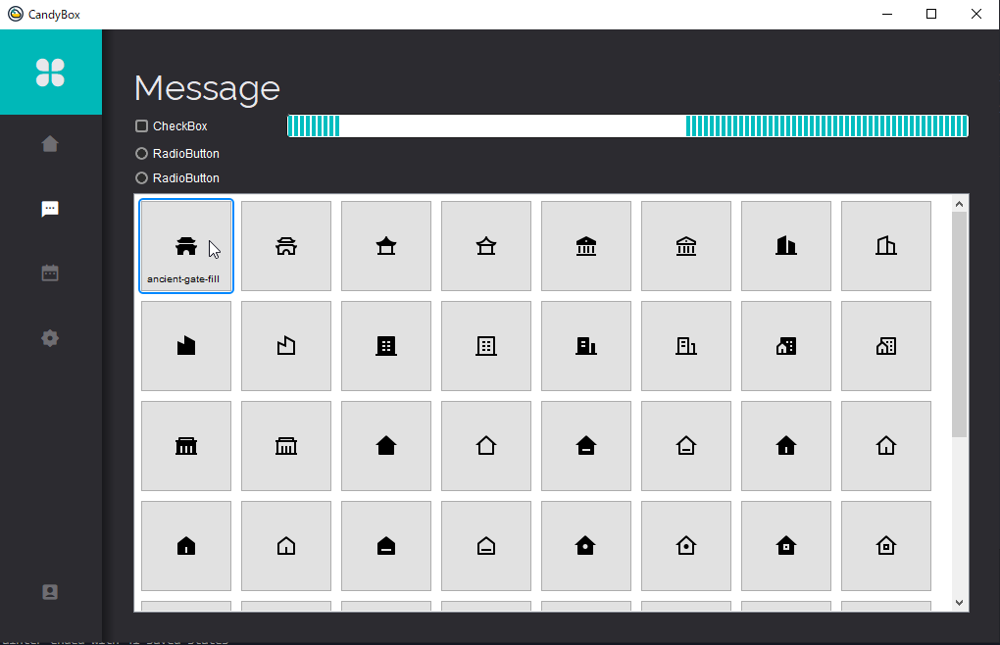

# はじめに
PySide2を使った複数人でのツール開発のためのモデル/ビューアーキテクチャにも対応したデザインサンプルです。  
これにより、モデラー、ビューアーなどで作業を分担しながらツールを開発することができます。  
また、このサンプルでは通常のPySide2では使用できないカスタムプロパティを使用できるようにQSSを拡張しています。  
そして、カスタムFontや画像を簡単に使用できるように、ビルド可能なbatを用意しました。
このプロジェクトはモックアッププロジェクトの為、実際に動作が期待できるような機能は実装していませんが、これらの機能も簡単に実装することができます。  

## 拡張機能
このサンプルにはPySide2を拡張したクラスがいくつかされています。  

  
例えば、QCircularSliderです。これは円の形をしたスライダーです、そういった拡張したクラスも.uiを利用して問題なくレイアウトできます。  

## Candyboxが動作するように設定する。

1. Python3のインストール  
まず、Python3をインストールしましょう。サンプルでは[Python 3.10.6](https://www.python.org/downloads/release/python-3106/)を使用しました。
2. virtualenvの作成  
VSCodeでFolderを開き、makevenv.batを実行しましょう。しばらくすると、 ../candybox/.venv が作成されているはずです。
3. 3.Pythonモジュールのインストール  
pipInstall.batを実行しましょう。様々なモジュールがインストールされるはずです。
4. 実行とデバッグ  
Run And Debug Candyboxを起動してください。