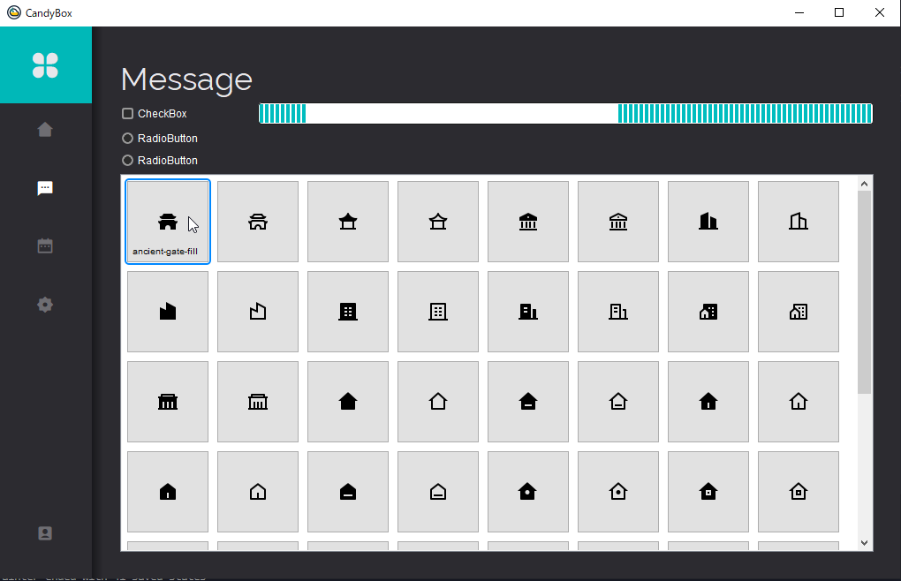

# Introduction
A design sample that also supports the model/view architecture for multi-person tool development using PySide2.
This allows you to develop tools while dividing the work between modelers, viewers, etc. QSS has also been extended to allow the use of custom properties that are not available in regular PySide2. I have also prepared a buildable bat that makes it easy to use custom Font and images. Since this is a sample, I have not implemented anything that will actually work, but you can easily implement these features as well.

!!! info
    Currently refactoring code from Python2.7 to Python3.10 based description.
    
    * Change from os to pathlib.
    * Support for pydantic.
    * Add TypeHint.
    * Change .ui loading method.
    * Clean up unnecessary properties.
    * Add docstrings.
    * Integration with the development environment for UnPySide tutorials in development eliminates the need to install Python and provides cross-platform compatibility with Maya and other DCC tools.
    
    etc...

## Extensions
This sample contains several classes that extend PySide2.  
  
For example, QCircularSlider. This is a slider in the shape of a circle. Such extended classes can also be laid out without problems using .ui.  

## Setting up Candybox to work.

1. Install a Python3  
Let’s first install Python3. The sample used [Python 3.10.6](https://www.python.org/downloads/release/python-3106/)
2. Create a virtualenv  
Execute Terminal > Run Task... > `[venv] create venv` After a while, you will see `${workspaceFolder}/.venv` should be created.
3. Install python modules  
Execute Terminal > Run Task... > `[venv] pip install`.
4. Launch or Run and Debug.  
Execute either Terminal > Run Task... > `Candybox` or `Python: Launch Candybox`.
